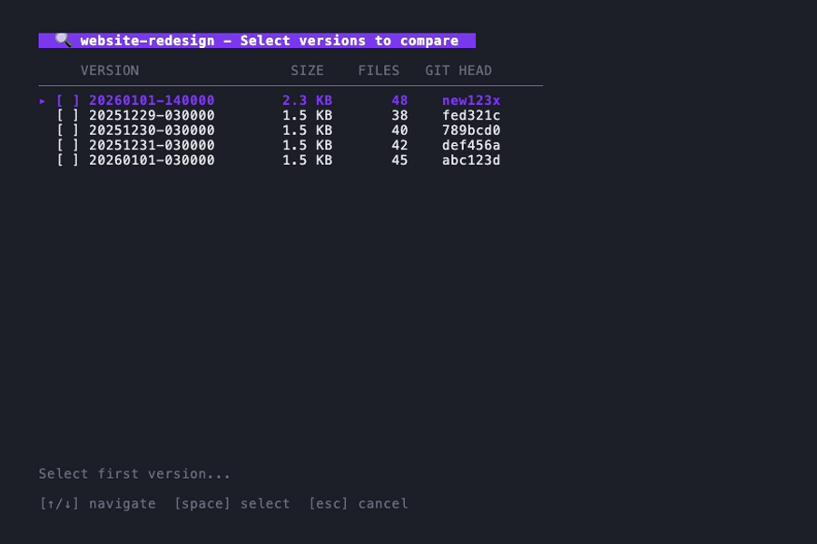
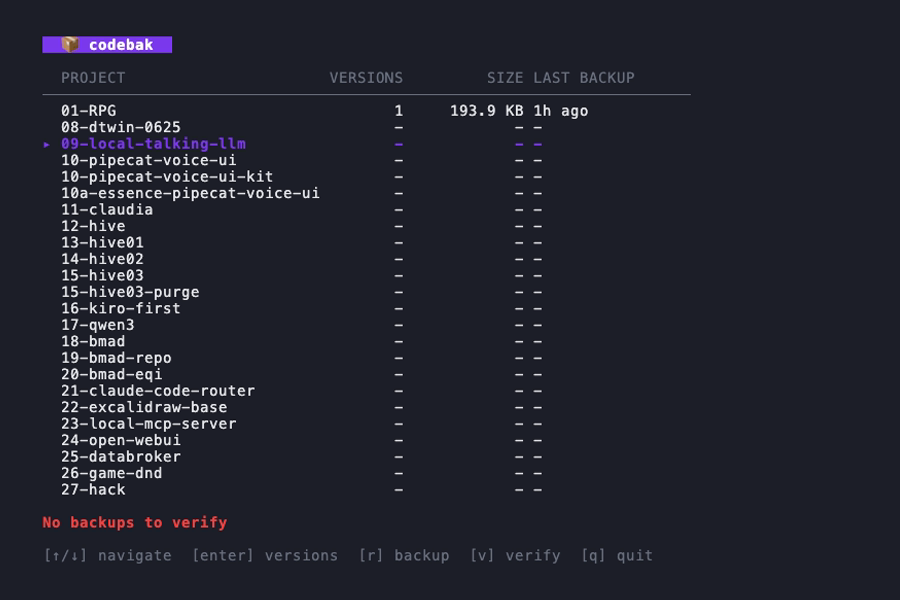

<p align="center">
  <h1 align="center">codebak</h1>
  <p align="center">
    <strong>Incremental code backup with a beautiful TUI</strong>
  </p>
  <p align="center">
    <a href="https://github.com/mcdonaldj/codebak/releases"></a>
    <a href="https://github.com/mcdonaldj/codebak/blob/main/LICENSE"></a>
    <a href="https://go.dev/"></a>
    <a href="https://github.com/mcdonaldj/codebak/actions"></a>
  </p>
</p>

<p align="center">
  
</p>

---

**codebak** automatically backs up your code projects with smart change detection. Browse backups, compare versions, and recover files through an interactive terminal UI.

## Features

- **Smart Change Detection** — Only backs up when git HEAD changes or files are modified
- **Interactive TUI** — Navigate projects, versions, and diffs with vim-style keybindings
- **Version Comparison** — Diff any two backup versions side-by-side
- **Integrity Verification** — SHA256 checksums ensure your backups are intact
- **Automatic Scheduling** — Set-and-forget daily backups via launchd
- **Safe Recovery** — Restore with archive or wipe options to protect existing code

<table>
<tr>
<td width="50%">

<p align="center"><em>Dashboard with all your projects</em></p>
</td>
<td width="50%">

<p align="center"><em>Version history with git commits</em></p>
</td>
</tr>
<tr>
<td width="50%">

<p align="center"><em>Select versions to compare</em></p>
</td>
<td width="50%">

<p align="center"><em>Verify backup integrity</em></p>
</td>
</tr>
</table>

## Installation

### Quick Install (Recommended)

```bash
curl -sSL https://raw.githubusercontent.com/mcdonaldj/codebak/main/install.sh | bash
```

### Homebrew

```bash
brew install mcdonaldj/tap/codebak
```

### From Source

```bash
git clone https://github.com/mcdonaldj/codebak.git
cd codebak
make install
```

## Quick Start

```bash
# 1. Create config file
codebak init

# 2. Edit config (optional)
$EDITOR ~/.codebak/config.yaml

# 3. Run your first backup
codebak run

# 4. Launch the TUI
codebak
```

## Configuration

Config file location: `~/.codebak/config.yaml`

```yaml
source_dir: ~/code           # Directory containing your projects
backup_dir: ~/backups        # Where backups are stored
schedule: daily
time: "03:00"

exclude:                     # Patterns to exclude from backups
  - node_modules
  - .venv
  - __pycache__
  - .git
  - target
  - dist
  - build

retention:
  keep_last: 30              # Keep last N backups per project
```

## Usage

### Commands

| Command | Description |
| ------- | ----------- |
| `codebak` | Launch interactive TUI |
| `codebak run [project]` | Backup changed projects |
| `codebak list <project>` | List backup versions |
| `codebak verify <project>` | Verify backup integrity |
| `codebak recover <project>` | Restore from backup |
| `codebak install` | Enable daily scheduled backups |
| `codebak status` | Show config and schedule status |

### TUI Keybindings

| Key | Action |
| --- | ------ |
| `j` / `k` | Navigate up/down |
| `Enter` | Select item |
| `Backspace` | Go back |
| `d` | Enter diff mode |
| `Space` | Toggle selection |
| `v` | Verify backup |
| `r` | Recover version |
| `q` | Quit |

### Recovery Options

```bash
# Restore latest (fails if project exists)
codebak recover myproject

# Restore and archive existing
codebak recover myproject --archive

# Restore and delete existing
codebak recover myproject --wipe

# Restore specific version
codebak recover myproject --version=20241215-100000
```

## How It Works

```text
~/code/                          ~/backups/
├── project-a/                   ├── project-a/
│   └── (your code)      ──►     │   ├── manifest.json
├── project-b/                   │   ├── 20241215-030000.zip
│   └── (your code)              │   └── 20241216-030000.zip
└── project-c/                   └── project-b/
    └── (your code)                  ├── manifest.json
                                     └── 20241216-030000.zip
```

1. **Detect** — Monitors git HEAD or file mtimes for changes
2. **Backup** — Creates timestamped zip with exclusions applied
3. **Track** — Maintains manifest with checksums and metadata
4. **Prune** — Automatically removes old backups per retention policy

## Contributing

Contributions are welcome! Please feel free to submit a Pull Request.

## License

MIT License - see [LICENSE](LICENSE) for details.
