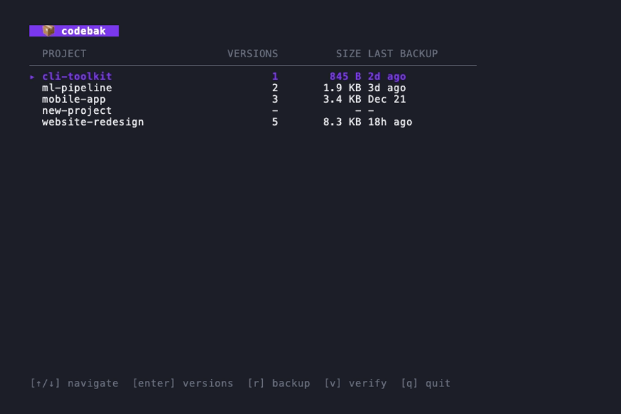
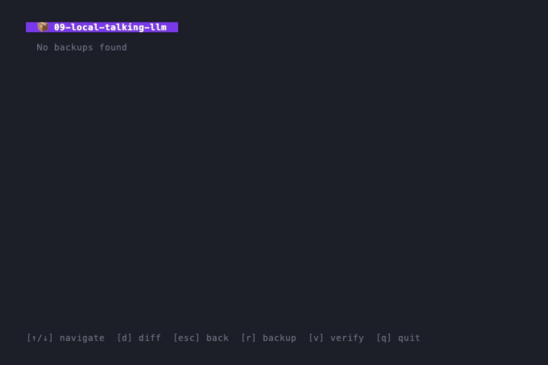
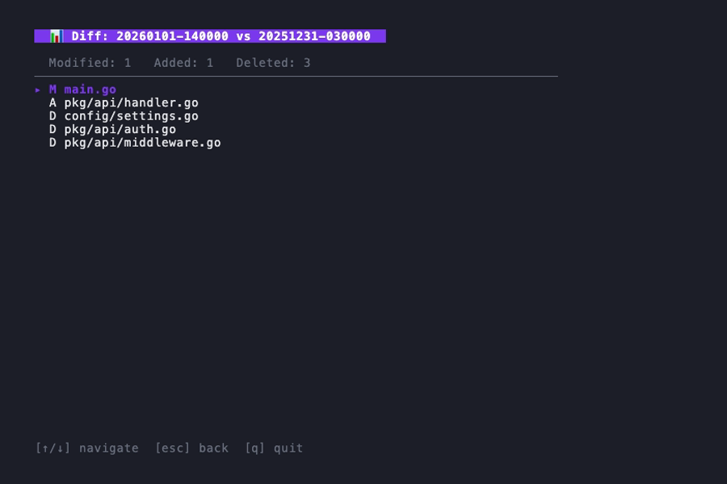
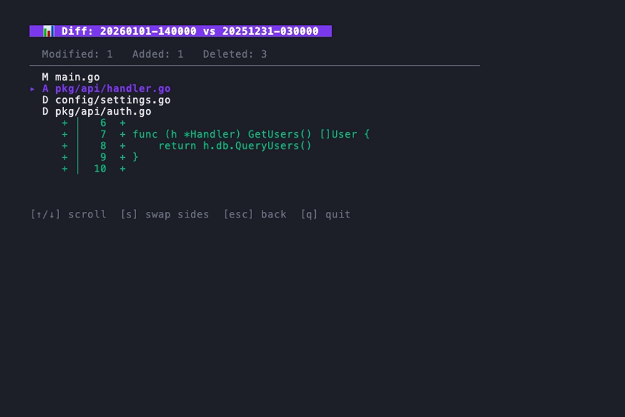

<p align="center">
  <h1 align="center">codebak</h1>
  <p align="center">
    <strong>A terminal UI for automated code backups with version diffing and recovery</strong>
  </p>
  <p align="center">
    <em>Smart change detection • Browse & compare versions • One-key recovery</em>
  </p>
  <p align="center">
    
    <a href="https://github.com/jmcdonald/codebak/releases"></a>
    <a href="https://github.com/jmcdonald/codebak/blob/main/LICENSE"></a>
    <a href="https://go.dev/"></a>
    <a href="https://github.com/jmcdonald/codebak/actions"></a>
    <a href="https://codecov.io/gh/jmcdonald/codebak"></a>
  </p>
</p>

<p align="center">
  
</p>

---

**codebak** automatically backs up your code projects with smart change detection. Browse backups, compare versions, and recover files through an interactive terminal UI.

## Features

- **Smart Change Detection** — Only backs up when git HEAD changes or files are modified
- **Sensitive Path Protection** — Encrypted restic backups for ~/.ssh, ~/.aws, and other sensitive config
- **Interactive TUI** — Navigate projects, versions, and diffs with vim-style keybindings
- **Version Comparison** — Diff any two backup versions to see added, modified, and deleted files
- **Line-by-Line Diff** — Drill into files to see exactly what changed with colored diffs
- **Integrity Verification** — SHA256 checksums ensure your backups are intact
- **Automatic Scheduling** — Set-and-forget daily backups via launchd
- **Safe Recovery** — Restore with archive or wipe options to protect existing code

<table>
<tr>
<td width="50%">

<p align="center"><em>Dashboard with all your projects</em></p>
</td>
<td width="50%">

<p align="center"><em>Version history with git commits</em></p>
</td>
</tr>
<tr>
<td width="50%">

<p align="center"><em>Compare versions: see what changed</em></p>
</td>
<td width="50%">

<p align="center"><em>Drill into files for line-by-line diff</em></p>
</td>
</tr>
</table>

## Installation

> **Note:** codebak is designed for **macOS** and uses launchd for scheduled backups.

### Quick Install (Recommended)

```bash
curl -sSL https://raw.githubusercontent.com/jmcdonald/codebak/main/install.sh | bash
```

### Homebrew

```bash
brew install jmcdonald/tap/codebak
```

### From Source

```bash
git clone https://github.com/jmcdonald/codebak.git
cd codebak
make install
```

## Quick Start

```bash
# 1. Create config file
codebak init

# 2. Edit config (optional)
$EDITOR ~/.codebak/config.yaml

# 3. Run your first backup
codebak run

# 4. Launch the TUI
codebak
```

## Configuration

Config file location: `~/.codebak/config.yaml`

```yaml
source_dir: ~/code           # Directory containing your projects
backup_dir: ~/.backups       # Where backups are stored (hidden folder)
schedule: daily
time: "03:00"

exclude:                     # Patterns to exclude from backups
  - node_modules
  - .venv
  - __pycache__
  - .git
  - target
  - dist
  - build

retention:
  keep_last: 30              # Keep last N backups per project

# Sensitive paths (encrypted with restic)
sources:
  - path: ~/code             # Git sources (default type)
    label: Code
  - path: ~/.ssh             # Sensitive sources (encrypted)
    type: sensitive
    label: SSH Keys
  - path: ~/.aws
    type: sensitive
    label: AWS Config
```

### Sensitive Paths (Encrypted Backups)

codebak can protect sensitive dotfiles and config directories with encrypted backups using [restic](https://restic.net/):

```yaml
# ~/.codebak/config.yaml
sources:
  - path: ~/code
    type: git                # Default: zip-based backups
  - path: ~/.ssh
    type: sensitive          # Restic encrypted backups
  - path: ~/.aws
    type: sensitive
  - path: ~/.config
    type: sensitive

restic:
  repo_path: ~/.codebak/restic-repo    # Optional, this is the default
  password_env_var: CODEBAK_RESTIC_PASSWORD  # Optional, this is the default
```

**Setup:**

```bash
# Set the encryption password (required)
export CODEBAK_RESTIC_PASSWORD="your-secure-password"

# Add to your shell profile for persistence
echo 'export CODEBAK_RESTIC_PASSWORD="your-secure-password"' >> ~/.zshrc
```

**Features:**
- 🔒 AES-256 encryption at rest
- Incremental backups (only changed blocks)
- Deduplication across all sensitive sources
- Automatic repository initialization on first backup

Sensitive sources display with a ◆ icon in the TUI and show snapshot counts instead of versions.

## Usage

### Commands

| Command | Description |
| ------- | ----------- |
| `codebak` | Launch interactive TUI |
| `codebak run [project]` | Backup changed projects |
| `codebak list <project>` | List backup versions |
| `codebak verify <project>` | Verify backup integrity |
| `codebak recover <project>` | Restore from backup |
| `codebak install` | Enable daily scheduled backups |
| `codebak uninstall` | Disable scheduled backups |
| `codebak status` | Show config and schedule status |
| `codebak move <path>` | Move all backups to new location |

### TUI Keybindings

| Key | Action |
| --- | ------ |
| `j` / `k` | Navigate up/down |
| `Enter` | Select item / drill into file |
| `Backspace` | Go back |
| `d` | Enter diff mode |
| `Space` | Toggle version selection |
| `s` | Swap diff sides (in file diff view) |
| `v` | Verify backup |
| `r` | Recover version |
| `?` | Open Settings |
| `q` | Quit |

### Settings View

| Key | Action |
| --- | ------ |
| `j` / `k` | Navigate settings |
| `Enter` | Select setting |
| `Esc` | Return to previous view |

**Migrate Backups** opens a folder picker with shortcuts:
- `~` jump to home, `.` jump to backup dir, `-` go back
- `/` or `g` type path directly
- `s` or `Space` select current folder

See [docs/folder-picker.md](docs/folder-picker.md) for full documentation.

### Recovery Options

```bash
# Restore latest (fails if project exists)
codebak recover myproject

# Restore and archive existing
codebak recover myproject --archive

# Restore and delete existing
codebak recover myproject --wipe

# Restore specific version
codebak recover myproject --version=20241215-100000
```

## How It Works

```text
~/code/                          ~/.backups/
├── project-a/                   ├── project-a/
│   └── (your code)      ──►     │   ├── manifest.json
├── project-b/                   │   ├── 20241215-030000.zip
│   └── (your code)              │   └── 20241216-030000.zip
└── project-c/                   └── project-b/
    └── (your code)                  ├── manifest.json
                                     └── 20241216-030000.zip
```

1. **Detect** — Monitors git HEAD or file mtimes for changes
2. **Backup** — Creates timestamped zip with exclusions applied
3. **Track** — Maintains manifest with checksums and metadata
4. **Prune** — Automatically removes old backups per retention policy

## Contributing

Contributions are welcome! Please feel free to submit a Pull Request.

## License

MIT License - see [LICENSE](LICENSE) for details.
